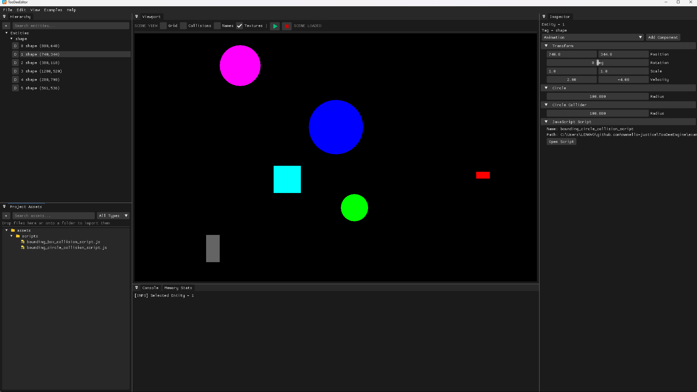

# TooDeeEngine 🎮

A lightweight, high-performance 2D game engine built with **C++23** using [SFML](https://www.sfml-dev.org/) for rendering and [ImGui](https://github.com/ocornut/imgui) for UI and editor tooling. It provides a flexible entity-component system, physics simulation, JavaScript and Lua scripting, and an integrated editor for rapid game development.



## Documentation

All documentation lives on the website in [`apps/website`](apps/website) (Astro + Starlight).

```bash
pnpm install
pnpm nx dev website
```

| Page | Contents |
|---|---|
| [Getting Started](apps/website/src/content/docs/guides/getting-started.mdx) | Build the engine, editor, CLI, and examples |
| [Installation](apps/website/src/content/docs/guides/installation.mdx) | Install the engine library or pre-built packages |
| [Configuration](apps/website/src/content/docs/guides/configuration.mdx) | INI game config and `.env` build options |
| [Examples](apps/website/src/content/docs/guides/examples.mdx) | Example games and scripting demos |
| [Packaging](apps/website/src/content/docs/guides/packaging.mdx) | Archives, installers, and universal packages |
| [Requirements](apps/website/src/content/docs/reference/requirements.md) | Per-platform toolchains and dependencies |
| [Architecture](apps/website/src/content/docs/reference/architecture.mdx) | ECS, components, and the game loop |

## Quick Start

```bash
just setup   # configure with CMake + vcpkg
just build   # debug build
just edit    # launch the editor
```

## Contributing

Contributions are not being accepted at this time. See
[Contributing](apps/website/src/content/docs/project/contributing.mdx) and
[AGENTS.md](AGENTS.md).

## License

MIT — see [LICENSE](LICENSE). Copyright © 2026 Mamello Justice.
